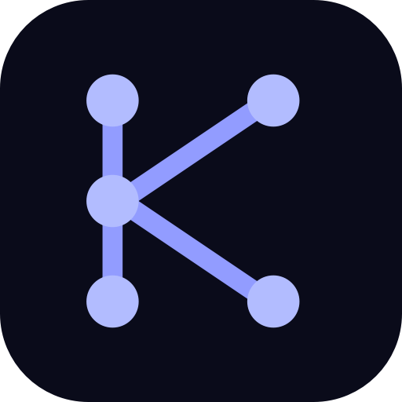
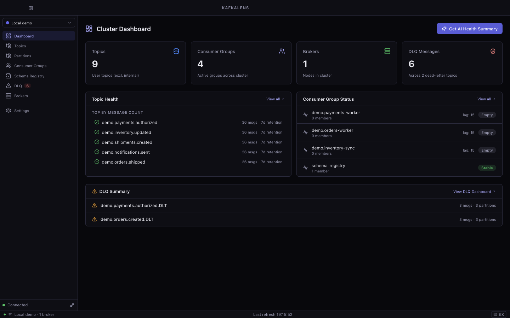
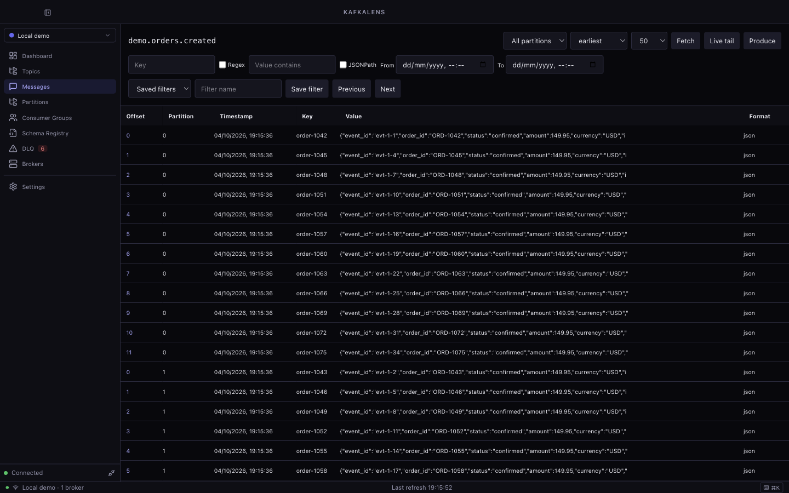
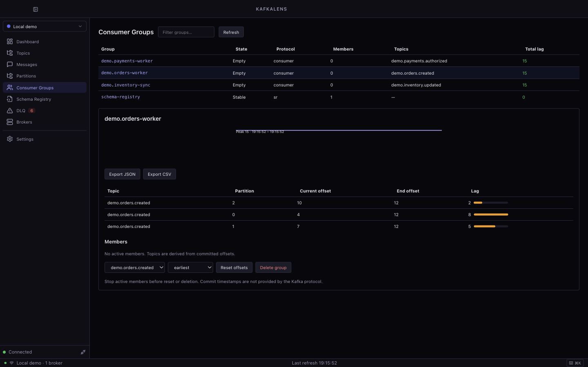
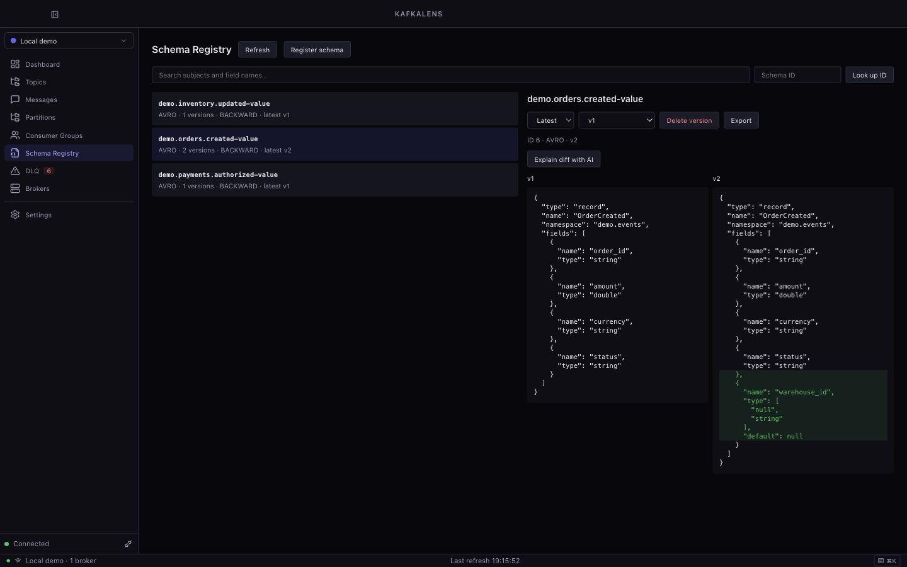

<p align="center">
  
</p>

<h1 align="center">KafkaLens</h1>

<p align="center"><strong>A free, open-source desktop workspace for Apache Kafka on macOS.</strong></p>

Browse messages, investigate consumer lag, compare schemas, and replay failed records from one window. KafkaLens brings topic, partition, consumer group, Schema Registry, and broker views together, with an optional AI assistant for explanations and troubleshooting.



Connect local, development, staging, and production clusters with distinct environment labels. A dark interface, command palette, and page shortcuts keep everyday Kafka work close at hand.

> [!NOTE]
> Version 1.0.0 is in release preparation. Local source builds are available; signed distribution and remaining acceptance gates are tracked in [Validation results](docs/VALIDATION.md).

## Highlights

- **Multiple clusters** — Saved connection profiles, environment colors, TLS, SASL/PLAIN, and SASL/SCRAM authentication; profile imports and exports exclude credentials.
- **Topics and partitions** — Search, favorites, topic creation and configuration, plus partition leaders, replicas, ISR, offset bounds, and exports.
- **Message inspection** — JSON, Avro, Schema Registry Protobuf, string, and binary decoding; bounded live tail, timestamp seeking, forward/backward paging, and saved timestamp/key/JSONPath filters.
- **Message production** — Compose JSON, string, binary, and Avro records with keys, headers, partition targeting, schema validation, and reusable templates.
- **Consumer groups** — Member assignments, per-partition lag, session trends, offset resets, and JSON/CSV offset exports.
- **Schema Registry** — Subject and field search, schema ID lookup, version history, compatibility checks, registration, and side-by-side diffs.
- **Dead letter queues** — Discover DLQ topics, inspect failure metadata, persist reviews, and replay selected records with original bytes, headers, and tombstones preserved.
- **Broker configuration** — Descriptions, defaults, cross-broker comparisons, durable change history, and exports.
- **Optional AI** — Message explanations, DLQ analysis, schema and configuration advice, health summaries, semantic topic search, and opt-in lag anomaly monitoring.
- **Keyboard access** — Command palette, page navigation, topic search, and refresh shortcuts.

## A look inside

Screenshots show the actual app connected to a disposable local Kafka cluster with sample order, payment, and inventory events.

<details>
<summary><strong>Browse messages</strong> — offsets, partitions, decoded values, and filters</summary>



</details>

<details>
<summary><strong>Inspect consumer groups</strong> — lag, committed offsets, and exports</summary>



</details>

<details>
<summary><strong>Compare schemas</strong> — subjects, versions, and field changes</summary>



</details>

## Requirements

- macOS 13 or newer
- Node.js 24 and npm 11 or newer for source builds
- A reachable Kafka cluster; Schema Registry is optional
- Docker with Compose for the disposable local cluster and integration checks
- Your own OpenAI, Anthropic, or Google Gemini API key if you enable AI

Docker and an AI key are optional for normal use with an existing cluster.

## Build from source

Clone, install the locked dependencies, validate, and install the app:

```bash
git clone https://github.com/Captain-Sangam/KafkaLens.git kafkalens
cd kafkalens
make install
make check
make export
```

Launch **KafkaLens** from Spotlight (`⌘Space`). `make export` builds a local unsigned app and installs it to `/Applications` when writable, otherwise `~/Applications`. Quit an existing KafkaLens instance before replacing it. To choose another destination:

```bash
make export APP_DEST="$HOME/Applications"
```

For development with hot reload, use `make dev`. The Makefile clears `ELECTRON_RUN_AS_NODE` when launching Electron, including from IDE terminals. Build output goes to `apps/desktop/out/`; packaged output goes to `apps/desktop/release/`.

Signed packaging, notarization, and release publication are covered in the [Release guide](docs/RELEASE.md).

## Connect a cluster

1. Open **Settings** (`⌘,` or `⌘7`) and choose **Add Cluster**.
2. Enter a name, bootstrap servers, environment label, and authentication details. Add a Schema Registry URL if needed.
3. Choose **Test Connection**, save the profile, then select it in the sidebar to connect.

For a local sandbox, start the checked-in Kafka and Schema Registry fixtures:

```bash
make fixtures-up
```

Use bootstrap server `localhost:19092`, no authentication, and Schema Registry URL `http://localhost:18081`. Create a topic and produce a record to start exploring. When finished, `make fixtures-down` removes the disposable fixtures and their volumes.

If a connection fails, check broker reachability, advertised listener addresses, VPN access, and the profile's TLS/SASL settings.

## AI assistant and privacy

AI is disabled by default. In **Settings → AI Configuration**, enable AI, select OpenAI, Anthropic, or Google Gemini, choose a model, and add your API key. Explicitly consent to sharing selected payloads and configuration with that provider, then save the settings. Individual features can be disabled independently; background lag anomaly analysis requires an additional opt-in.

Configured field patterns redact matching content before requests leave the app. Review these settings against your data before using AI. Kafka browsing and management work without an AI key.

Kafka, Schema Registry, and AI credentials are stored in the macOS Keychain. SQLite stores connection metadata, preferences, favorites, filter presets, templates, DLQ reviews, and broker snapshots. Existing plaintext credentials are migrated before removal, with the original data recoverable if Keychain access fails.

AI history is also disabled by default. If enabled, it keeps the last 50 generated responses and provider/feature metadata locally; request inputs and API keys are excluded. Generated responses may still contain information derived from the supplied context.

## Operational safeguards

Topic deletion, offset resets, and schema version deletion require confirmation. Production-labeled clusters also require the resource name to be typed. DLQ replay shows a confirmation before producing records, with an additional typed confirmation for production.

Unavailable Kafka metadata is shown as unavailable. KafkaJS does not expose broker log directories, leader epochs, broker Kafka versions, or offset commit timestamps through the current implementation. Offset spans are not exact retained record counts for compacted or transactional topics.

## Development commands

Run `make` or `make help` for the full target list. The [Makefile](Makefile) wraps the npm workspace scripts.

| Command        | Purpose                                         |
| -------------- | ----------------------------------------------- |
| `make dev`     | Run Electron and the renderer with hot reload   |
| `make start`   | Build and launch the production preview         |
| `make check`   | Lint, typecheck, run unit tests, and build      |
| `make test`    | Run unit tests                                  |
| `make package` | Build unsigned local macOS DMG and ZIP previews |
| `make clean`   | Remove generated builds, packages, and coverage |

To regenerate the README screenshots using an isolated app profile and sample data:

```bash
make fixtures-up
make screenshots
make fixtures-down
```

The capture script writes to `docs/images/`, removes its demo records and temporary profile, and leaves your normal KafkaLens profile untouched.

Run real Kafka, Schema Registry, desktop, and performance checks against the disposable fixtures:

```bash
make fixtures-up
make test-integration
make test-desktop
make test-performance
make fixtures-down
```

The app uses Electron, React, TypeScript, Tailwind CSS, Zustand, KafkaJS, and SQLite. Kafka connections, persistence, credentials, and AI calls run in the main process; the isolated renderer communicates through a typed preload bridge. See [Agent and architecture guidelines](AGENTS.md) for implementation conventions.

## Keyboard shortcuts

| Shortcut                  | Action                                     |
| ------------------------- | ------------------------------------------ |
| `⌘K`                      | Command palette                            |
| `⌘R`                      | Refresh the current page                   |
| `⌘T`                      | Open topics and focus search               |
| `⌘,`                      | Settings                                   |
| `⌘1` / `⌘2` / `⌘3`        | Dashboard / Topics / Consumer Groups       |
| `⌘4` / `⌘5` / `⌘6` / `⌘7` | Schema Registry / DLQ / Brokers / Settings |

## Documentation

- [Product requirements and roadmap](PRD.md)
- [Agent and architecture guidelines](AGENTS.md)
- [Validation results and remaining acceptance gates](docs/VALIDATION.md)
- [Release preparation and signed distribution](docs/RELEASE.md)

Local validation covers unit checks, a plaintext Kafka/Registry fixture, and an unsigned Apple Silicon desktop build. The 150 MB idle-memory target remains unmet. Signed distribution, live AI provider checks, secured multi-broker coverage, and a complete accessibility audit remain open; the validation document records the evidence and limits.

## Contributing

Contributions are welcome. Read [CONTRIBUTING.md](CONTRIBUTING.md) for setup, validation, safety conventions, and how to report security issues privately. For substantial features, open an issue describing the proposed workflow before implementation.

## License

KafkaLens is available under the [Apache License 2.0](LICENSE). See [NOTICE](NOTICE) for attribution.
